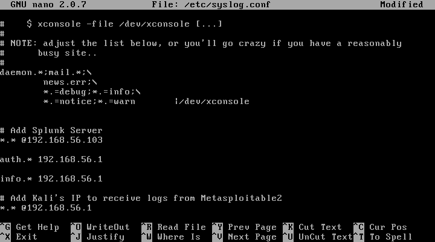
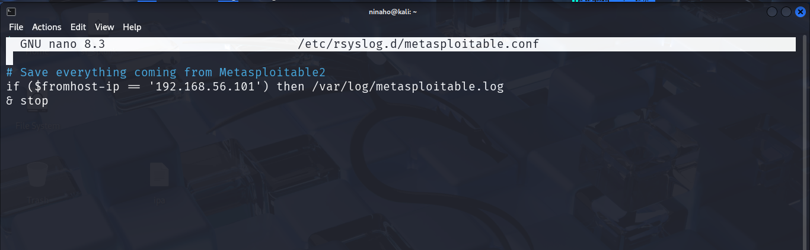
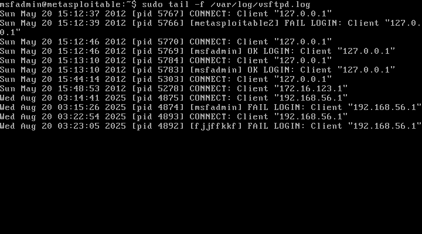
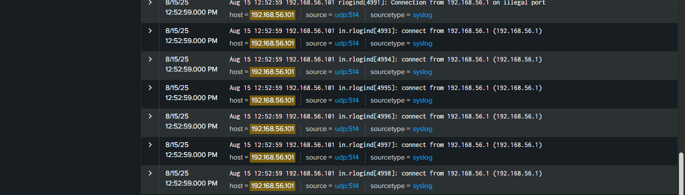
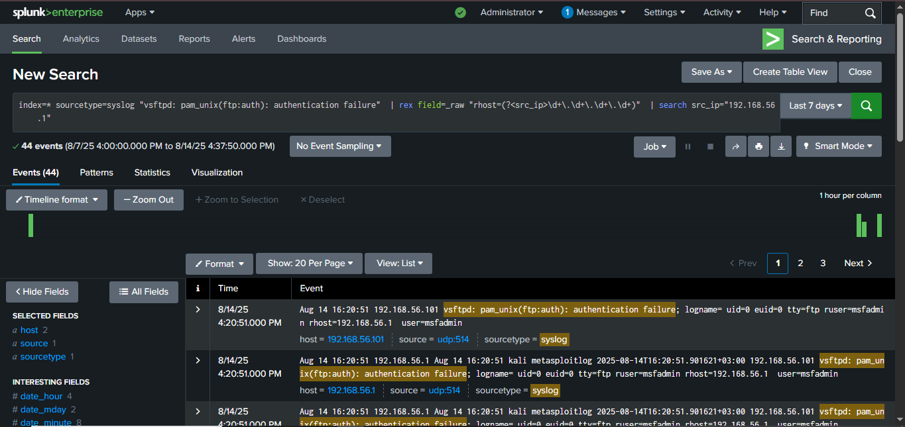
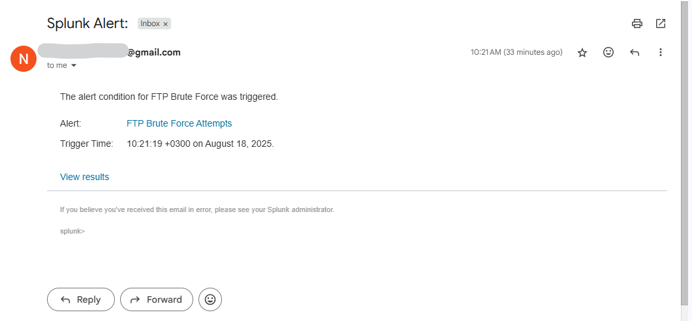

# Threat Detection and Splunk SIEM Implementation & Tuning

## Project Overview

This project focuses on real-time detection and visualization of brute force attacks and network reconnaissance by ingesting and analyzing syslog data using Splunk.

The objective is to simulate a Security Operations Center (SOC) scenario where security analysts detect and respond to threats using centralized log monitoring and detection.

---

## Tools & Technologies Used

- **Kali Linux** (Attacker VM): For generating simulated malicious traffic and logs.

- **Metasploitable 2** (Victim VM): Intentionally vulnerable target.

- **Windows Host** (With Splunk): central log collector and analysis interface.

- **Splunk Enterprise** : used to collect, index, and analyze machine data from the attacker and target systems.

- **Bash Scripting** : used to create scripts that read specific log files and forward entries to Splunk.

---

## Objectives

- Simulate a real-world network security environment using virtual machines (Kali Linux, Metasploitable2) and a Windows host machine.

- Capture and forward logs from attacker and target machines to Splunk for centralized analysis.

- Practice log monitoring, event correlation, and threat detection using Splunk.

- Demonstrate system visibility and network activity tracking for defensive cybersecurity skills.

---

## Steps Taken

1. Virtual Lab Setup & Installing rsyslog Service in Kali.

2. Network Configuration & Assigning IP Addresses.

3. Verifying Network Connectivity.

4. Configure Splunk to Receive Logs from Kali and Metasploitable2 VMs.

5. Configuring Kali Linux and Metasploitable2 VMs to Send Logs to Splunk.

6. Configure Log Forwarding for Specific Files on Both Kali and Metasploitable2 VMs.

7. Testing the /var/log/vsftpd.log File Configuration with Trigger Activity from Kali.

8. Sending the /var/log/metasploitable.log File to Splunk.

9. Creating Alerts In Splunk.

10. Verifying Email Alerts Received.
---

### Step 1: Virtual Lab Setup & Checking rsyslog Service in Kali

#### Virtual Lab Setup

| Component       | Configuration                     |
|----------------|-----------------------------------|
| Host OS         | Windows 10 - Where Splunk Is Installed To Monitor Logs from Kali and Metasploitable2  |
| Attacker        | Kali Linux VM - To Generate Traffic (port scans, attacks etc)           |
| Target          | Metasploitable2 VM - Intentionally Vulnerable                          |
| Network Type    | Host-Only Adapter (VirtualBox Host-Only Ethernet Adapter)                            |
| Host IP         | `192.168.56.103`                                                                     |
| Attacker IP     | `192.168.56.1`                                                                       |
| Target IP       | `192.168.56.101`                                                                     | 


---

#### Checking for the status of rsyslog in Kali Linux VM

In Kali Linux, rsyslog is a system logging service that gathers, processes, and stores log messages from system components, applications, and services. 

Its main role is to centralize and manage system logs, which are essential for monitoring, troubleshooting, and security auditing.

I first verified if rsyslog service is active and enabled by executing:

```
sudo systemctl status rsyslog
```

The command indicated service not found, meaning rsyslog needed to be installed. 

Before proceeding to install rsyslog, I checked the network interfaces and details such as IP addresses, subnet masks, and default gateways.

On the Windows terminal, I checked for the network configuration details by executing:

```
ipconfig
```

This reviewed all network configuration details for each adapter. The Wireless LAN Wi-Fi Adapter configuration was:

| Wireless LAN Wi-Fi Adapter   | Configuration details    |
|-----------------------------|--------------------------|
| IP Address                   | `192.168.43.184`          |
| Subnet mask                  | `255.255.255.0`           |
| Default gateway              | `192.168.43.24`           |

These details facilitated the configuration of Kali Linux VM which was set to use a bridged adapter, enabling it to connect directly to the Windows host's network. This setup makes the VM function as a standalone machine on the network with its own IP address and direct access to the internet for installing rsyslog service.

Kali's IP was assigned dynamically by the DHCP server. In the Kali terminal, routing was then set by executing:

```
sudo ip route add 192.168.43.0/24 dev eth0
```

This directs all traffic for the 192.168.43.0/24 subnet through the eth0 interface, facilitating communication with external networks and the internet as if the VM were a physical device.

To test Kali's connectivity to the internet, Google's public DNS server was pinged:

```
ping -c 4 8.8.8.8
```

This command sends four ICMP echo requests to 8.8.8.8. A result of 0% packet loss verified network connectivity and internet access.

---

#### Installing the rsyslog Service

After confirming connectivity, rsyslog service was installed in Kali by running:

```
sudo apt update
```

```
sudo apt install rsyslog
```

To confirm the installation:

```
sudo systemctl status rsyslog
```


*Screenshot on checking the status of rsyslog service in Kali*

The output indicated that the service was active and enabled, confirming that rsyslog had been successfully installed.

I then reconfigured the network setup to utilize a host-only adapter for the project. This choice was made because a host-only adapter restricts Kali Linux VM and Metasploitable2 VM to communicate solely with the Windows host.

It is ideal for the project as it provides a controlled environment for testing and development, prevents external network interference, enhances security by limiting network exposure, and eliminates the need for internet access or interaction with other devices on the physical network.

---

### Step 2: Network Configuration & Assigning of IP Addresses

After reconfiguring the adapter to host-only, I restarted both Kali and start Metasploitable2 VMs, checked for Windows host's Ethernet adapter IP address in Windows command prompt by executing:

```
ipconfig
```

The Windows Ethernet adapter IP address was identified as "192.168.56.103". Using this information, I reconfigured both Kali and Metasploitable2 VMs to operate on the same subnet as the Windows Ethernet adapter, ensuring seamless communication within the host-only network.

---

#### 2.1 Assigning a Static IP to Kali Linux VM

In the Kali terminal, network interfaces file was modified to assign a static IP address 192.168.56.1:

```
sudo nano /etc/network/interfaces
```

In the file, the network interface was configured to use a static IP by adding:

```
auto eth0
iface eth0 inet static
    address 192.168.56.1
    netmask 255.255.255.0
    gateway 192.168.56.103
```

This set the static IP address to 192.168.56.1 for eth0, with the specified netmask and the Windows host's IP address (192.168.56.103) as the gateway.

Adding the "auto eth0" line ensures the interface is brought up automatically at boot, and that the static IP is persistent across reboots. 


*Screenshot on assigning a static IP address to Kali*

The networking service was then restarted to apply the changes: 

```
sudo systemctl restart networking
```

To confirm the assigned static IP address:

```
ip a
```

This verifies eth0 interface listed with IP address 192.168.56.1

To add the current routing table to Kali's routing table:

```
sudo ip route add 192.168.56.0/24 dev eth0
```

To verify the routing added:

```
ip route
```


*Screenshot on verifying the current routing table and confirming Kali's network interface*

The screenshot above indicates that traffic to the 192.168.56.0/24 network will be routed through eth0, hence confirming routing and Kali's eth0 interface.

The setup uses host-only adapter, meaning all the three machines are all operating in the same subnet. Adding and verifying the eth0 interfaces is important because it adds a route to Kali's routing table, specifically telling the system if you're trying to reach the 192.168.56.0/24 network, send that traffic through interface eth0.

If Kali does not have a route to that subnet, it would not know where to send packets, leading to "unreachable" errors when pinging or connecting.

---

#### 2.2 Assigning a static IP to Metasploitable2 VM

In the Metasploitable2 terminal, network configuration file was modified to assign a static IP address 192.168.56.101:

```
sudo nano /etc/network/interfaces
```

In the file, the network interface was configured to use a static IP by adding:

```
auto eth0
iface eth0 inet static
    address 192.168.56.101
    netmask 255.255.255.0
    gateway 192.168.56.103
```

The networking service was then restarted to apply the changes:

```
sudo /etc/init.d/networking restart
```

Metasploitable2 is based on an old Linux version - Ubuntu 8.04. It uses SysVinit, not systemd, so systemctl does not exist there, hence it cannot be used to restart the network interface.

To confirm the assigned Metasploitable2 IP address:

```
ip a
```
 
The output verified eth0 interface listed with IP address 192.168.56.101

---

### Step 3: Verifying Network Connectivity

Now that the Windows host machine, Kali Linux and Metasploitable2 VMs are all configured to operate within the same subnet (192.168.56.0/24), connectivity was verified to ensure that they are communicating as expected. 

On Kali terminal, ping Metaspoitable2 and Windows IP addresses:

```
ping 192.168.56.101 
ping 192.168.56.103
```


*Screenshot on verifying network connectivity from Kali*

On Windows command prompt, ping Kali and Metasploitable2 IP addresses:

```
ping 192.168.56.1
ping 192.168.56.101
```

On Metasploitable2 terminal, ping Kali and Windows IP addresses:

```
ping 192.168.56.1
ping 192.168.56.103
```

The successful response from all the three machines confirmed they are all on the same 192.168.56.0/24 subnet and can ping each other. 

This verification step is critical as it shows that the virtual environment was properly isolated and communication was working as expected.

---

### Step 4: Configure Splunk to Receive Logs from Kali and Metasploitable2 VMs

After successful ping tests, Splunk was then configured to receive logs from both Kali Linux and Metasploitable VMs.

Started by setting up Splunk to listen for data on Windows host where Splunk is installed. This is a a core step in any Splunk setup because without data inputs, Splunk has nothing to analyze. 

The data inputs are added so as to collect and ingest external data for indexing, searching, monitoring, and analysis.

#### 4.1 Create a New UDP Data Input in Splunk

Most network devices (routers, switches, firewalls, etc.) are pre-configured to send syslog via UDP port 514, as it is lightweight and does not require a handshake or session setup.

To create a new UDP Data Input in Splunk, launch Splunk in the browser:

```
http://localhost:8000
```

Log in with credentials.

Go to:

Settings >  Data Inputs

Under Local Inputs, click UDP.

Click "Add new".

For the Port, I entered 514 

Then set "Source type" to syslog 

I left the rest as default and clicked on "Submit".

In the next step, Kali Linux and Metasploitable2 VMs were configured to send logs to Splunk.

---

### Step 5: Configuring Kali Linux and Metasploitable2 VMs to Send Logs to Splunk

#### 5.1 Configuring Kali Linux VM To Send Logs To Splunk

Kali Linux uses rsyslog to handle logs, so rsyslog was configured to forward logs to Splunk.

In Kali terminal, the rsyslog configuration file was opened:

```
sudo nano /etc/rsyslog.conf
```

At the bottom of the file, the following line was added to send logs to Windows host IP address where Splunk is installed:

```
*.* @192.168.56.103:514
```

The @ means UDP and 514 is the port Splunk is listening on for Syslog messages.

rsyslogd, used on modern systems such as Kali, supports specifying the port like @192.168.128.1:514.


*Screenshot on adding Splunk Server in Kali Linux*

After saving the changes, rsyslog was restarted to apply the changes:

```
sudo systemctl restart rsyslog
```

Now that Kali Linux has been configured to send logs to Splunk, I verified that the logs are successfully being sent to Splunk by creating a test logger and searching for the log in Splunk by running a test log in Kali terminal:

```
logger "test message from Kali"
```

I then proceeded to Splunk's Search & Reporting dashboard, and ran a search with index="test message from Kali" to see the incoming test log from Kali as shown below:


*Screenshot on verifying if Kali logs are being sent to Splunk*

The screenshot above verified that Splunk was receiving logs from Kali VM.

---

#### 5.2 Configuring Metasploitable2 VM To Send Logs To Splunk

Metasploitable2 uses syslogd (the traditional syslog daemon) to handle logs, not rsyslog as in Kali. 

To configure Metasploitable2 to send logs to Splunk, I opened the syslog configuration file on Metasploitable2:

```
sudo nano/etc/syslog.conf
```

At the bottom of the file, the following line was added to send logs to Windows host IP address where Splunk is installed:

.*    @192.168.56.103

The reason I did not use :514 in "*.* @192.168.56.103"  is because syslogd (older, used by Metasploitable2) does not support custom port syntax in /etc/syslog.conf. It always sends to port 514 by default when using @.

After saving the configuration, syslogd was restarted to apply the changes.

Since systemctl or service doesn't work in Metasploitable2, to restart syslogd, the following command was executed: 

```
sudo killall -HUP syslogd
```

Now that Metasploitable2 has been configured to send logs to Splunk, I verified that the logs are successfully being sent to Splunk by creating a test logger and searching for the log in Splunk by running a test log in Metasploitable2 terminal:

```
logger 'test message from Metasploitable2'
```

I then proceeded to Splunk's Search & Reporting dashboard, and ran a search with index="test message from Metasploitable2" to see the incoming test log from Metasploitable2 as shown below:


*Screenshot on verifying if Metasploitable2 logs are being sent to Splunk*

The screenshot above verified that Splunk was receiving logs from Metasploitable2 VM IP 192.168.56.101.

---

### Step 6: Configure Log Forwarding for Specific Files on Both Kali and Metasploitable2 VMs

Metasploitable2 needed to be configured to forward specific log files to Splunk, but it does not support imfile if rsyslog is not installed. The imfile module allows rsyslog to treat log files as an input source.

Upgrading rsyslog manually may be a hassle due to the old syslog distro. Due to this limitation, I proceeded with the traditional log forwarding, which is to forward logs from Metasploitable2 to Kali Linux using the default syslogd on Metasploitable2 and rsyslog on Kali, which will then be forwarded from Kali to the Splunk server. 

#### 6.1 Enable Kali's rsyslog to Receive Logs from Metasploitable2

I first configured Kali to receive logs from Metasploitable2 VM, by editing the rsyslog config to enable receiving logs over UDP:

```
sudo nano /etc/rsyslog.conf
```

To provide UDP syslog reception, uncomment the following lines:

```
module(load="imudp")        # Loads the UDP listener module
input(type="imudp" port="514")  # Listens for syslog messages on UDP 514
```


*Screenshot on enabling Kali's rsyslog to receive logs from Metasploitable2*

Saved, exited and restarted rsyslog service to apply the changes:

```
sudo systemctl restart rsyslog
```

I then proceeded to enable remote logging on Metasploitable2 so as to send log messages to Kali.

---

#### 6.2 Enable remote logging on Metasploitable2

To enable remote logging on Metasploitable2, the syslogd config was edited in Metasploitable2 terminal:

```
sudo nano /etc/syslog.conf
```

The following line was appended at the bottom:

```
*.*   @192.168.56.1
```



*Screenshot on enabling remote logging on Metasploitable2*

This forwards system logs from Metasploitable2 to Kali so as to detect Nmap scans, brute-force attempts, and other exploit activities.

Saved, exited the file, and restarted syslog to apply the changes:

```
sudo killall -HUP syslogd
```

---

#### 6.3 Forward Logs from Metasploitable2 to Kali Linux

Kali Linux had already been configured to receive logs over UDP in step 6.1 above.

I proceeded to create a dedicated log file for Metasploitable2 logs in Kali Linux by running:

```
sudo nano /etc/rsyslog.d/metasploitable.conf
```

In the file, the following configuration was added:

```
if ($fromhost-ip == '192.168.56.101') then /var/log/metasploitable.log
& stop
```


*Screenshot on forwarding Metasploitable2 logs to Kali*

The configuration rule above directs log messages from Metasploitable2, to be written to the file /var/log/metasploitable.log in Kali. 

Once the logs from Metasploitable2 are processed and saved to the specified file, the rule stops further processing of these messages, preventing them from being handled by additional rsyslog rules.

Saved the file, exited and restarted rsyslog to apply the changes:

```
sudo systemctl restart rsyslog
```

---

#### 6.4 Forward /var/log/vsftpd.log from Metasploitable2 to Kali using syslogd + logger

The file vsftpd.log holds logs generated by the FTP service. It contains logs such as connection attempts, authentication failures, commands issued by the client/attacker (Kali VM), errors and warnings such as improper commands or syntax. 

One of this project's main objectives is to detect, monitor and investigate these exploit activities. Because of this, vsftpd.log had to be configured to reach Splunk so as to give visibility into all FTP-related activities.

vsftpd.log is not handled by syslog, which means it will not be forwarded unless we explicitly tell Metasploitable2's syslog daemon to watch vsftpd.log file. I then proceeded to configure logs from vsftpd.log to be forwarded live to Kali so as to get logs on activities on the vulnerable FTP service, which will then be forwarded from Kali to Splunk.

I forwarded vsftpd.log file to Kali using syslogd + logger command by creating a forwarding script on Metasploitable2 to tail and forward the logs:

```
sudo nano /usr/local/bin/forward_vsftpd.sh
```

The following was added to the file:

```
#!/bin/bash   # This script watches the vsftpd log file and forwards each new log line to rsyslog under local7.info.

tail -Fn0 /var/log/vsftpd.log | while read line; do
    logger -p local7.info "$line"
done
```

This script pipes the contents of /var/log/vsftpd.log in Metasploitable2 into a logger, and the logger sends it into rsyslog in Kali, rsyslog then forwards it over to Windows host, where Splunk is listening as previously configured in step 4.1.

I then made the file executable by running:

```
sudo chmod +x /usr/local/bin/forward_vsftpd.sh
```

To run it in the background or at boot without hanging up if the terminal session ends, the following was executed:

```
nohup /usr/local/bin/forward_vsftpd.sh &
```

I ran a failed login attempts' test exploit on the FTP service from Kali and checked for incoming FTP logs in Metasploitable2 by running:

```
sudo tail -f /var/log/vsftpd.log
```



*Screenshot on verifying forwarded Metasploitable2 logs to Kali*

The screenshot above verifies that vsftpd.log file in Metasploitable2 was receiving the failed login attempts logs.

---

### Step 7: Testing the /var/log/vsftpd.log File Configuration with Trigger Activity from Kali

More exploit activities were performed on Metasploitable2 from Kali to generate more logs. Nmap scans were done to identify open ports and their corresponding services and versions by running:

```
nmap -sV 192.168.56.101
```

#### 7.1 Check On Kali For Metasploitable2 Logs From The Failed FTP login

To check for Metasploitable's ftp failed login attempts logs and connection attempts from Kali, a new Kali terminal was launched and the following command executed:

```
sudo tail -f /var/log/metasploitable.log
```

The command continuously monitors and displays new entries written to the file /var/log/metasploitable.log in real-time. 


*Screenshots on checking triggered activity logs on Metasploitable2 from Kali*

From the screenshots above, I identified entries like connection attempts as a result of the nmap scan and authentication failures on the FTP service, which confirmed that log forwarding and the attack simulation from the previous steps was working properly.

Now that logs from Metasploitable2's /var/log/vsftpd.log are arriving in Kali's /var/log/metasploitable.log, I proceeded to ship them to Splunk using rsyslog to detect nmap scans, brute-force attempts and other exploit in Splunk.

---

### Step 8: Send /var/log/metasploitable.log File To Splunk

To ship /var/log/metasploitable.log file in Kali to Splunk, rsyslog was updated to monitor that log. This was done by running:

```
sudo nano /etc/rsyslog.d/70-metasploitable.conf
```

rsyslog processes files in lexical order (alphabetically and numerically). By adding the number prefix (70-), it controls the load order of the config.

We use number prefixes when we want to ensure order of rule application (e.g., 60-authlog.conf first, 70-metasploitable.conf after), and for easy management and clarity of many config files.

In the file, the following configurations were added:

```
input(type="imfile"
  File="/var/log/metasploitable.log"
  Tag="metasploitlog"
  Severity="info"
  Facility="local6")

local6.*  @192.168.56.103:514
```

The configuration above tells rsyslog to watch the file /var/log/metasploitable.log, tag the entries, label them as info/local6, and send them to Splunk (Windows host) at 192.168.56.103 via UDP port 514.

Saved, exited and restarted rsyslog to apply the changes:

```
sudo systemctl restart networking
```

---

#### 8.1 Verify vsftpd logs In Splunk

In this step, I verified that the logs in /var/log/metasploitable.log file in Kali were reaching Splunk by running a search for the logs in Splunk's Search & Reporting as shown below:

```
index=* host="192.168.56.1" "metasploitlog" "ftp"
```


*Sample screenshots on checking FTP Metasploitable2 logs from Kali In Splunk*

From the screenshot above, I confirmed that the FTP Metasploitable2 logs from Kali were reaching Splunk. 

The forwarded "authentication failure" logs represent brute-force attempts and failed FTP logins.

#### 8.2 Verify Connection Attempts Logs in Splunk

To verify showing connection attempts logs on Metasploitable2, the following search query was run:

```
index=* host="192.168.56.101"
```



*Sample screenshots on checking connection attempts on Metasploitable2 In Splunk*

The forwarded logs such as "connection from 192.168.56.1 on illegal port" represent Nmap scan attempts from the attacker machine Kali Linux.

---

### Step 9: Creating Alerts In Splunk

In this step, alerts and dashboards were created in Splunk to detect suspicious activities like brute-force, nmap scans and other exploit activities.

#### 9.1 Creating an Alert for Suspicious FTP Logins

The goal is to trigger an alert when multiple failed FTP login attempts are detected from the same IP.

Click Search & Reporting > Search

Run a detection search:

```
index=* sourcetype=syslog "vsftpd: pam_unix(ftp:auth): authentication failure"
| rex field=_raw "rhost=(?<src_ip>\d+\.\d+\.\d+\.\d+)"
| stats count by src_ip
| where count > 5
```

This search query:

- Filters logs for FTP login failures as indicated by the authentication failure tag.

- Extracts the attacker's IP address from rhost=.

- Counts the number of failed attempts per IP.

- Shows only IPs with more than 5 attempts.

The search returned the following results, suggesting brute-force attempts as shown below:


*Screenshot on checking brute-force attempts on Metasploitable2 from Splunk*

The screenshot above shows results of IP addresses (src_ip) with more than 5 failed login attempts. For this case, the IP address displayed is just one - Kali's IP address.

I then saved this as an alert:

Named it: FTP Brute Force Detected

Set trigger condition to:

- Type - Real-time

- Alert to expires after 1000 days 

- Trigger alert whenever search returns a result

- Enable Throttle on src_ip within 10 minutes - This means the alert from the same source IP will not trigger again for 10 minutes to avoid spam for repeated attacks from the same IP source, hence reducing alert noise.

Set actions to when an alert is triggered:

- Add it to the "Triggered Alerts" panel.

- Send an email to the email address provided.

- Set Alert Severity as: High

- I customized the email subject as: FTP Brute Force Attempt from $result.src_ip$ and saved the alert.

---

#### 9.2 Creating an Alert for Port Scans Detected

The goal is to trigger an alert when multiple failed FTP login attempts are detected from the same IP.

The query:

```
index=* sourcetype=syslog "connect from"  
| rex field=_raw "connect from (?<src_ip>\d+\.\d+\.\d+\.\d+)"  
| search src_ip="192.168.56.1"
```

This query:

- Filters logs that contain the phrase "connect from" which indicates connection attempts such as nmap scans.

- Extracts the source IP address usimg rex command which captures the IP that appears after "connect from".

- Filters the results to show only logs where the extracted IP is 192.168.56.1 and store it in a field called src_ip.

---

### Step 10: Verifying Email Alerts Received

The following screenshots confirm email alerts received from the triggered brute-force attempts and nmap port scans.


*Screenshot of FTP brute-force attempts email alert.*


*Screenshot of Metasploitable port scan detection email alert.*

---

## Conclusion

This project successfully demonstrated how security monitoring can be implemented within a virtual lab environment. It significantly strengthened the visibility and response capabilities of the network. 

By deploying Splunk as the central SIEM platform and tuning its search queries and alerting logic, the lab was able to detect key threats such as brute-force attacks and reconnaissance activity from the malicious IP addresses in real time.

The project highlights the importance of proper log collection, parsing, and tuning of detection rules in order to generate meaningful and actionable alerts.

Real-time alerts enabled immediate containment actions such as blocking the attacker IP and disabling affected services.

---

## Recommendations

To further improve the detection and response capabilities of this project, the following enhancements were done in the subsequent projects:

- Implement account lockout policies to limit brute-force activity.
- Introduce Multi-Factor Authentication to critical services to reduce credential theft.
- Establish normal activity baselines to better detect analities, and reduce false positives.
- Add contextual enrichment to alerts (hostname, target user, geolocation) for quicker triage.
- Automate containment actions such as auto-blocking malicious IP addresses to spped up response times.
- Expand detection coverage to other attack types such as data exfiltration, privilege escalation and malware activity.
- Develop and maintain monitoring dashboards to visualize malicious activity, top attacker IP addresses and alert trends over time. This helps quickly identify abnormal behavior and supports continuos tuning of detection rules.

---

*Please follow through the subsequent projects for the implementation of response capabilities outlined in Recommendations.*

*Click [here](https://github.com/ninahonyango/Elizabeth_P_A_Onyango) to go back to Portfolio.*

---
