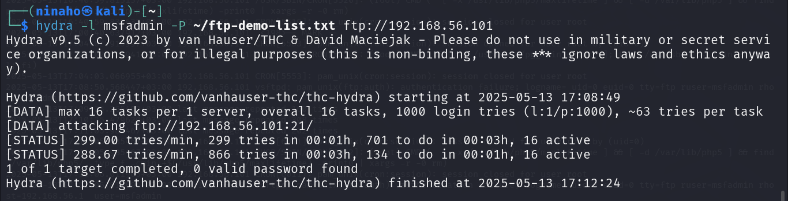
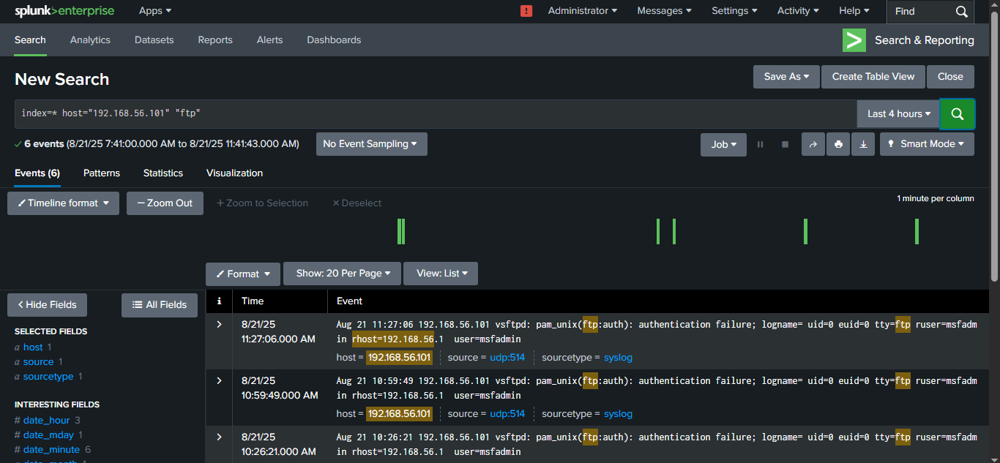
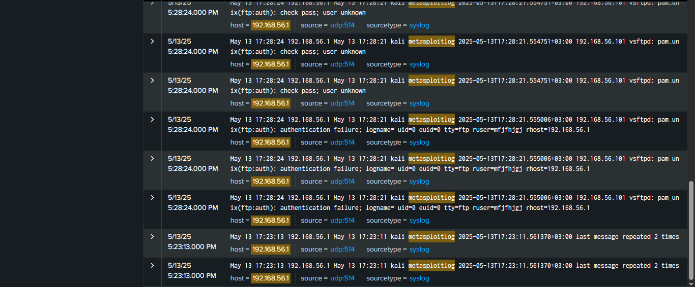

# 🔐 Detecting and Investigating Malicious Activities with Splunk SIEM

## 🧾 Project Overview

---

## 🛠️ Tools & Technologies Used

- **Kali Linux** (Attacker VM): For generating simulated malicious traffic and logs.

- **Metasploitable 2** (Victim VM): Intentionally vulnerable target.

- **Windows Host** (With Splunk): central log collector and analysis interface.

- **Splunk Enterprise** : used to collect, index, and analyze machine data from the attacker and target systems.

- **Bash Scripting** : used to create scripts that read specific log files and forward entries to Splunk.

---

## 🎯 Objectives

- Simulate a real-world network security environment using virtual machines (Kali Linux, Metasploitable2) and a Windows host machine.

- Capture and forward logs from attacker and target machines to Splunk for centralized analysis.

- Practice log monitoring, event correlation, and threat detection using Splunk.

- Demonstrate system visibility and network activity tracking for Blue Team (defensive) cybersecurity skills.

- Build a portfolio-ready cybersecurity lab showcasing hands-on experience in SIEM, log forwarding, and monitoring.

---

## 📖 Steps Taken

1. Virtual Lab Setup (Environment Preparation)

2. Verifying Network Connectivity

3. Configure Splunk to Receive Logs from Kali and Metasploitable2 VMs

4. Configure Log Forwarding for Specific Files on Both Kali and Metasploitable2 VMs

5. From Kali Trigger Activity On Metasploitable2

6. Check On Kali For Metasploitable2 Logs From Step 5 (Triggered Nmap Scan, Brute-force On FTP And Failed FTP logins)

7. Send /var/log/metasploitable.log File To Splunk

8. Creating Alerts And Dashboards In Splunk

---

### Step 1: 🧪 Virtual Lab Setup (Environment Preparation)

#### 💻 Prerequisites

| Component       | Configuration                     |
|----------------|-----------------------------------|
| Host OS         | Windows 10 - Where Splunk Is Installed To Monitor Logs from Kali and Metasploitable  |
| Attacker        | Kali Linux (VirtualBox VM) - To Generate Traffic (port scans, attacks etc)           |
| Target          | Metasploitable 2 (VirtualBox VM) - Intentionally Vulnerable                          |
| Network Type    | Host-Only Adapter (VirtualBox Host-Only Ethernet Adapter)                            |
| Host IP         | `192.168.56.103`                                                                     |
| Attacker IP     | `192.168.56.1`                                                                       |
| Target IP       | `192.168.56.101`                                                                     | 


---

#### Checking for the status of rsyslog in Kali Linux VM

In Kali Linux, rsyslog is a system logging service that gathers, processes, and stores log messages from system components, applications, and services. Its main role is to centralize and manage system logs, which are essential for monitoring, troubleshooting, and security auditing.

I verified if rsyslog service is active and enabled by executing:

```
sudo systemctl status rsyslog
```

The command indicated that the service is not found, meaning rsyslog needed to be installed. 

Before proceeding to install rsyslog, I checked the network interfaces and details such as IP addresses, subnet masks, default gateways, and other network settings. 

On the Windows host machine, the command prompt was launched and the following command executed:

```
ipconfig
```

This reviewed the configuration details for the Wireless LAN Wi-Fi Adapter, which were:

| Wireless LAN Wi-Fi Adapter   | Configuration details    |
|-----------------------------|--------------------------|
| IP Address                   | `192.168.43.184`          |
| Subnet mask                  | `255.255.255.0`           |
| Default gateway              | `192.168.43.24`           |

These details facilitated the configuration of the Kali Linux VM which was set to use a bridged adapter, enabling it to connect directly to the Windows host's network. This setup makes the VM function as a standalone machine on the network with its own IP address and direct access to network resources, allowing the VM to access the internet for installing rsyslog service.

Kali's IP was assigned dynamically by the DHCP server. In the Kali terminal, routing was then set by executing:

```
sudo ip route add 192.168.43.0/24 dev eth0
```

This command directs all traffic for the 192.168.43.0/24 subnet through the eth0 interface, enabling communication with local network devices.

With the bridged adapter, this configuration allows the VM to route traffic through the network's gateway (192.168.43.24), facilitating communication with external networks and the internet as if the VM were a physical device.

To test connectivity, Google's public DNS server was pinged by running:

```
ping -c 4 8.8.8.8
```

This command sends four ICMP echo requests to 8.8.8.8, verifying network connectivity, internet access, and server responsiveness. A result of 0% packet loss confirmed successful connectivity.

---

#### Installing the rsyslog Service

After confirming connectivity, I installed rsyslog service in Kali by running:

```
sudo apt update
```

Followed by:

```
sudo apt install rsyslog
```

To confirm the installation, execute:

```
sudo systemctl status rsyslog
```


*Screenshot on checking the status of rsyslog service in Kali*

The output indicates that the service is active and enabled, confirming that rsyslog has been successfully installed.

I then reconfigured the network setup to utilize a host-only adapter for the project. This choice was made because a host-only adapter restricts Kali Linux VM and Metasploitable2 VM to communicate solely with the Windows host. It is ideal for the project as it provides a controlled environment for testing and development, prevents external network interference, enhances security by limiting network exposure, and eliminates the need for internet access or interaction with other devices on the physical network.

---

#### 1.1 💡 Network Configuration And Assignment Of IP Addresses

After reconfiguring the adapter to host-only, restart Kali Linux and start Metasploitable2 VMs. I proceeded to check Windows host's Ethernet adapter IP address by launching Windows command prompt and executing:

```
ipconfig
```

The Windows host Ethernet adapter IP address was identified as `192.168.56.103`. Using this information, I configured both Kali Linux and Metasploitable2 VMs to operate on the same subnet as the Windows host, ensuring seamless communication within the host-only network.

---

#### 1.2 🔧 Assigning a static IP 192.168.56.1 to Kali Linux

To assign a static IP address 192.168.56.1 to Kali, launch Kali terminal and modify the network interfaces file by running:

```
sudo nano /etc/network/interfaces
```

In the file, the network interface was configured to use a static IP by adding:

```
auto eth0
iface eth0 inet static
    address 192.168.56.1
    netmask 255.255.255.0
    gateway 192.168.56.103
```

This sets the static IP address to 192.168.56.1 for eth0, with the specified netmask and the Windows host's IP address (192.168.56.103) as the gateway.

Adding the `auto eth0` line ensures the interface is brought up automatically at boot, and that the static IP is persistent across reboots. 


*Screenshot on assigning a static IP address to Kali*

Saved, exited the file `ctrl + x`, `enter` and restarted networking to apply the changes:

```
sudo systemctl restart networking
```

To confirm the assigned IP address, run:

```
ip a
```


*Screenshot on verifying Kali's IP address*

The screenshot above verifies eth0 interface listed with IP address 192.168.56.1

To verify the current routing table and Kali's network interface, execute:

```
ip route
```

The route to the 192.168.56.0/24 network was not present, it had not automatically been configured during boot. It was then added manually by executing:

```
sudo ip route add 192.168.56.0/24 dev eth0
```

To confirm the route has been successfully added, execute:

```
ip route
```


*Screenshot on verifying the current routing table and confirming Kali's network interface*

The screenshot above shows a line indicating that traffic to the 192.168.56.0/24 network will be routed through eth0, hence confirming routing and Kali's interface.

Because the setup uses host only adapter, the three machines: Kali VM, Metasploitable2 VM, and Windows host are all operating in the same subnet. Checking and adding the eth0 interface is important because it adds a route to Kali's routing table, specifically telling the system if you're trying to reach the 192.168.56.0/24 network, send that traffic through interface eth0.

If Kali does not have a route to that subnet, it would not know where to send packets, leading to "unreachable" errors when pinging or connecting.

---

#### 1.3 🔧 Assigning a static IP 192.168.56.101 to Metasploitable2

To assign Metasploitable2 VM with a static IP address, launch the terminal in Metasploitable2 and edit the network configuration file:

```
sudo nano /etc/network/interfaces
```

In the file, I configured the network interface to use a static IP address by adding:

```
auto eth0
iface eth0 inet static
    address 192.168.56.101
    netmask 255.255.255.0
    gateway 192.168.56.103
```

Saved, exited the file `ctrl + x`, `enter` and restarted networking to apply the changes by running:

```
sudo /etc/init.d/networking restart
```

Metasploitable2 is based on an old Linux version - Ubuntu 8.04. It uses SysVinit, not `systemd`, so `systemctl` does not exist there, hence it cannot be used to restart the network interface.

To confirm the assigned Metasploitable2 IP address, run:

```
ip a
```
 
The output verified eth0 interface listed with IP address 192.168.56.101

---

### Step 2: ✅ Verifying Network Connectivity

Now that the Windows host machine, Kali Linux VM and Metasploitable2 VM are all on the same network (host only Adapter) and configured to operate within the same subnet (192.168.56.0/24), connectivity was verified to ensure that they are communicating as expected. 

✅ Step-by-Step:

On Kali terminal, ping Metaspoitable2 and Windows IP addresses:

```
ping 192.168.56.101 
ping 192.168.56.103
```


*Screenshot on verifying network connectivity from Kali*

On Windows command prompt, ping Kali and Metasploitable2 IP addresses:

```
ping 192.168.56.1
ping 192.168.56.101
```


*Screenshot on verifying networking connectivity from Windows*

On Metasploitable2 terminal, ping Kali and Windows IP addresses:

```
ping 192.168.56.1
ping 192.168.56.103
```

The successful response from all the three machines confirmed they are all on the same 192.168.56.0/24 subnet and can ping each other. 

This verification step is critical as it shows that the virtual environment was properly isolated and communication was working as expected.

---

### Step 3: 🔧 Configure Splunk to Receive Logs from Kali and Metasploitable2 VMs

After successful ping tests, Splunk was then configured to receive logs from both Kali Linux and Metasploitable VMs.

Started by setting up Splunk to listen for data on Windows host (where Splunk is installed).

#### 🔹 3.1 Create a New UDP Data Input in Splunk

A new data input must first be created or added in Splunk so as to collect and ingest external data for indexing, searching, monitoring, and analysis. This is a core step in any Splunk setup because without data inputs, Splunk has nothing to analyze.

Most network devices (routers, switches, firewalls, etc.) are pre-configured to send syslog via UDP port 514. It is lightweight and does not require a handshake or session setup.

To create a new UDP Data Input in Splunk, launch Splunk in the browser:

```
http://localhost:8000
```

Log in with credentials.

Go to:

Settings → Data Inputs

Under Local Inputs, click UDP.

Click "Add new".

For the Port, enter 514 which is common for syslog

Set "Source type" to syslog 

I left the rest as default and clicked on "Submit".


*Screenshot on creating a new UDP data input in Splunk*

In the next step, Kali Linux and Metasploitable2 VMs were configured to send logs to Splunk.

---

#### 🔹 3.2 Configure Kali Linux And Metasploitable2 VMs to Send Logs to Splunk

#### A. Configuring Kali Linux VM To Send Logs To Splunk

Kali Linux uses rsyslog to handle logs, so rsyslog was configured to forward logs to Splunk.

I first opened the rsyslog configuration file on Kali by running:

```
sudo nano /etc/rsyslog.conf
```

At the bottom of the file, the following line was added to send logs to Splunk (Windows host IP address where Splunk is installed):

```
*.* @192.168.56.103:514
```

The @ means UDP and 514 is the port Splunk is listening on for Syslog messages.

rsyslogd (used on modern systems like Kali) supports specifying the port like @192.168.128.1:514.


*Screenshot on adding Splunk Server in Kali Linux*

After saving the configuration, rsyslog was restarted to apply the changes:

```
sudo systemctl restart rsyslog
```

Now that Kali Linux has been configured to send logs to Splunk, I verified that the logs are successfully being sent to Splunk by creating a test logger and searching for the log in Splunk by running a test log in Kali terminal:

```
logger "test message from Kali"
```

I then proceeded to Splunk's Search & Reporting dashboard, and ran a search with index="test message from Kali" to see the incoming test log from Kali as shown below:


*Screenshot on verifying if Kali logs are being sent to Splunk*

The screenshot above verified that Splunk was receiving logs from Kali VM.

---

#### B. Configuring Metasploitable2 VM To Send Logs To Splunk

Metasploitable2 uses syslogd (the traditional syslog daemon) to handle logs, not rsyslog as in Kali. 

To configure Metasploitable2 to send logs to Splunk, I opened the syslog configuration file on Metasploitable2:

```
sudo nano/etc/syslog.conf
```

At the bottom of the file, the following line was added to send logs to Splunk (Windows host IP address where Splunk is installed):

.*    @192.168.56.103

The reason I did not use :514 in *.* @192.168.56.103 for traditional syslogd (used by Metasploitable2) is because syslogd (older, used by Metasploitable2) does not support custom port syntax in /etc/syslog.conf. It always sends to port 514 by default when using @.

After saving the configuration, syslogd was restarted to apply the changes.

Since systemctl or service doesn't work in Metasploitable2, to restart syslogd, the following command was executed: 

```
sudo killall -HUP syslogd
```

Now that Metasploitable2 has been configured to send logs to Splunk, I verified that the logs are successfully being sent to Splunk by creating a test logger and searching for the log in Splunk by running a test log in Metasploitable2 terminal:

```
logger 'test message from Metasploitable2'
```

I then proceeded to Splunk's Search & Reporting dashboard, and ran a search with index="test message from Metasploitable2" to see the incoming test log from Metasploitable2 as shown below:


*Screenshot on verifying if Metasploitable2 logs are being sent to Splunk*

The screenshot above verified that Splunk was receiving logs from Metasploitable2 VM.

---

### Step 4: 🛠 Configure Log Forwarding for Specific Files on Both Kali and Metasploitable2 VMs

#### 🔹 4A. Kali Linux Log Forwarding (Attacker Machine)

To enable Kali Linux to monitor specific log files, such as /var/log/auth.log, and forward new entries to the Splunk server in real time, a custom rsyslog configuration file was created by running:

```
sudo nano /etc/rsyslog.d/60-authlog.conf
```

I then added the following in the file:

```
module(load="imfile")

input(type="imfile"
      File="/var/log/auth.log"
      Tag="kali-auth"
      Severity="info"
      Facility="local6")

local6.*    @192.168.56.103:514
```


*Screenshot on enabling Kali to forward auth-logs to Splunk*

Breakdown:

- The imfile module allows rsyslog to treat the /var/log/auth.log file as an input source.

- It monitors /var/log/auth.log for new log entries.

- Each new entry is tagged with kali-auth for clear identification in Splunk.

- The logs are assigned the local6 facility and forwarded via UDP to the Splunk server at 192.168.56.103 on port 514.

After saving the configuration, I restarted rsyslog to apply the changes:

```
sudo systemctl restart rsyslog
```

I then proceeded to Splunk's Search & Reporting dashboard, and ran a search with "index=* kali-auth" to verify the incoming new auth entries to the Splunk server:

```
index=* "kali-auth"
```


*Screenshot on verifying if Kali auth-logs are being sent to Splunk*

---

#### 🔹 4B. Metasploitable2 Log Forwarding (Target Machine)

Metasploitable2 was also configured to forward specific log files to Splunk. 

Metasploitable2 does not support imfile if rsyslog is not installed, and upgrading rsyslog manually may be a hassle due to the old distro. 

Due to this limitation, I proceeded with the traditional log forwarding, which to forward logs from Metasploitable2 to Kali Linux using the default syslogd on Metasploitable2 and rsyslog on Kali, which will then be forwarded from Kali to the Splunk server. 

#### 🔹 On Kali Linux, enable rsyslog to receive logs from Metasploitable2

I first configured Kali to receive logs from Metasploitable2 VM, by editing the rsyslog config to enable receiving logs over UDP by running:

```
sudo nano /etc/rsyslog.conf
```

To provide UDP syslog reception, uncomment/add the following lines:

```
module(load="imudp")        # Loads the UDP listener module
input(type="imudp" port="514")  # Listens for syslog messages on UDP 514
```


*Screenshot on enabling Kali's rsyslog to receive logs from Metasploitable2*

Saved, exited and restarted rsyslog service to apply the changes:

```
sudo systemctl restart rsyslog
```

I then proceeded to enable remote logging on Metasploitable2 so as to send log messages to Kali.

---

#### 🧩 Enable remote logging on Metasploitable2

To enable remote logging on Metasploitable2, edit the syslogd config in Metasploitable2 terminal:

```
sudo nano /etc/syslog.conf
```

The following line was appended to forward logs to Kali's IP address:

```
*.*   @192.168.56.1
```

This forwards system logs from Metasploitable2 to Kali so as to detect Nmap scans, brute-force attempts, and other exploit activities.

I then saved, exited the file, and restarted syslog to apply the changes:

```
sudo killall -HUP syslogd
```

---

#### 🔹 4C. Forward Logs from Metasploitable2 to Kali Linux

Kali Linux had already been configured to receive logs over UDP in step 4B above.

I proceeded to create a dedicated log file for Metasploitable2 logs in Kali Linux by running:

```
sudo nano /etc/rsyslog.d/metasploitable.conf
```

In the file, the following configuration was added:

```
if ($fromhost-ip == '192.168.56.101') then /var/log/metasploitable.log
& stop
```


*Screenshot on forwarding Metasploitable2 logs to Kali*

The configuration rule above directs log messages from Metasploitable2, to be written to the file /var/log/metasploitable.log in Kali. Once the logs from Metasploitable2 are processed and saved to the specified file, the rule stops further processing of these messages, preventing them from being handled by additional rsyslog rules.

I then saved the file, exited and restarted rsyslog to apply the changes:

```
sudo systemctl restart rsyslog
```

---

#### 🔹 4D. Forward /var/log/vsftpd.log from Metasploitable2 to Kali using syslogd + logger

One of this project's main objectives is to detect and investigate malicious activities such as nmap scans on Metasploitable2 and other exploit activities on the FTP server running on Metasploitable2. 

The file vsftpd.log holds logs generated by the vsftpd service running on Metasploitable2. It contains logs such as connection attempts, authentication failures, commands issued by the client, errors and warnings such as improper commands or syntax among others. It is specifically used to record FTP server activity, and is particularly relevant when testing or exploiting vulnerabilities like the famous vsftpd 2.3.4 backdoor or brute-force attempts on the FTP server. Because I wanted to monitor these exploit activities, vsftpd.log had to be configured to reach Splunk so as to give visibility into all FTP-related activities.

vsftpd.log is not handled by syslog, which means it will not be forwarded unless we explicitly tell Metasploitable2's syslog daemon to watch that file. I then proceeded to configure logs from vsftpd.log to be forwarded live to Kali so as to get logs on activities on the vulnerable FTP service, which will then be forwarded from Kali to Splunk.

I ran a test exploit on the FTP service from Kali to verify that the /var/log/vsftpd.log file in Metasploitable2 is receiving logs, I then forwarded it to Kali using syslogd + logger command.

To forward /var/log/vsftpd.log from Metasploitable2 to Kali using syslogd + logger, I created a forwarding script on Metasploitable2 to tail and forward the logs:

```
sudo nano /usr/local/bin/forward_vsftpd.sh
```

The following was added to the file:

```
#!/bin/bash   # This script watches the vsftpd log file and forwards each new log line to rsyslog under local7.info.

tail -Fn0 /var/log/vsftpd.log | while read line; do
    logger -p local7.info "$line"
done
```

This script pipes the contents of /var/log/vsftpd.log in Metasploitable2 into a logger, and the logger sends it into rsyslog in Kali, rsyslog then forwards it over to Windows host, where Splunk is listening as previously configured in step 3.2.

I then made the file executable by running:

```
sudo chmod +x /usr/local/bin/forward_vsftpd.sh
```

To run it in the background or at boot without hanging up if the terminal session ends, the following was executed:

```
nohup /usr/local/bin/forward_vsftpd.sh &
```

---

### Step 5: 🔹 From Kali Trigger Activity On Metasploitable2

To test the configuration in step 4D above and to generate logs, I triggered activities on Metasploitable2 from Kali. 

I performed a nmap scan to identify open ports and their corresponding services and versions by running:

```
nmap -sV 192.168.56.101
```


*Screenshots showing a detailed Metasploitable2 scan with service and version detection from Kali*

I also did a brute-force attack on Metasploitable2's FTP server with Kali as the attacker machine as shown below:


![Kali Brute-Force Attack On Metasploitable2;s FTP Server Screenshot[(images/bruteforce2.png)
*Screenshots of brute-force attacks on Metasploitable2's FTP Server with Kali as the attacker machine*

The above screenshots show brute-force attempts which discovered 9 valid username-password combinations. I then tried logging into the FTP server using a fake username and password as illustrated below:


*Screenshot on failed FTP login attempts from Kali*

---

### Step 6: 🔍 Check On Kali For Metasploitable2 Logs From Step 5 (Triggered Nmap Scan, Brute-force On FTP And Failed FTP logins)

To check logs on Metasploitable2's triggered activities in Kali, a new Kali terminal was opened and the following command executed:

```
sudo tail -f /var/log/metasploitable.log
```

The command above continuously monitors and displays new entries written to the file /var/log/metasploitable.log in real-time. 


*Screenshots on checking triggered activity logs on Metasploitable2 from Kali*

From the screenshots above, we can see entries like connection attempts and authentication failures, which confirmed that log forwarding and the attack simulation in step 5 is working properly.

Now that logs from Metasploitable2 are arriving in /var/log/metasploitable.log on Kali Linux, let's now ship them to Splunk using rsyslog to detect nmap scans, brute-force attempts, and other exploit in Splunk.

---

### Step 7: 🧩 Send /var/log/metasploitable.log File To Splunk

To ship /var/log/metasploitable.log file in Kali to Splunk, rsyslog was updated to monitor that log. This was done by running:

```
sudo nano /etc/rsyslog.d/70-metasploitable.conf
```

Rsyslog processes files in lexical order (alphabetically and numerically). By adding the number prefix (70-), it controls the load order of the config.

We use number prefixes when we want to ensure order of rule application (e.g., 60-authlog.conf first, 70-metasploitable.conf after), and for easy management and clarity of many config files.

In the file, the following configurations were added:

```
input(type="imfile"
  File="/var/log/metasploitable.log"
  Tag="metasploitlog"
  Severity="info"
  Facility="local6")

local6.*  @192.168.56.103:514
```

The configuration above tells rsyslog to watch the file /var/log/metasploitable.log, tag the entries, label them as info/local6, and send them to Splunk (Windows host) at 192.168.56.103 via UDP port 514.

I then saved, exited and restarted rsyslog to apply the changes:

```
sudo systemctl restart networking
```

---

#### 🔹 7A. Verify In Splunk

In this step, I verified that the logs in /var/log/metasploitable.log file in Kali were reaching Splunk by running a search for the logs in Splunk's Search & Reporting as shown below:

```
index=* host="192.168.56.1" "metasploitlog"
```




*Sample screenshots on checking Metasploitable2 logs from Kali In Splunk*

From the screenshot above, I confirmed that the Metasploitable2 logs were reaching Splunk. The forwarded logs like:

- Connection from 192.168.56.1 on illegal port - represent Nmap scan attempts

- Authentication failure - represent brute-force attempts and failed FTP logins

---
